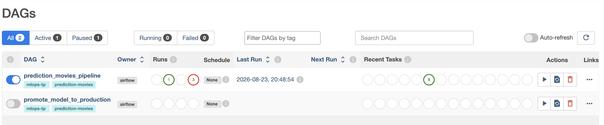
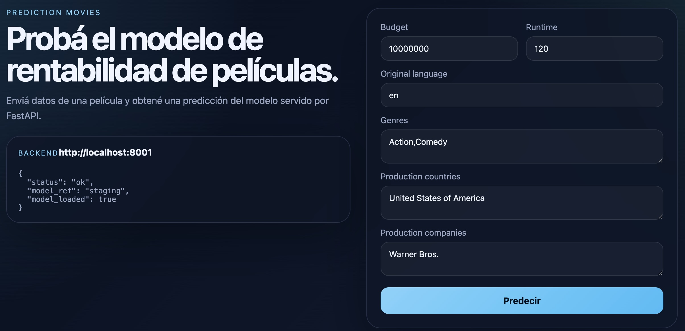
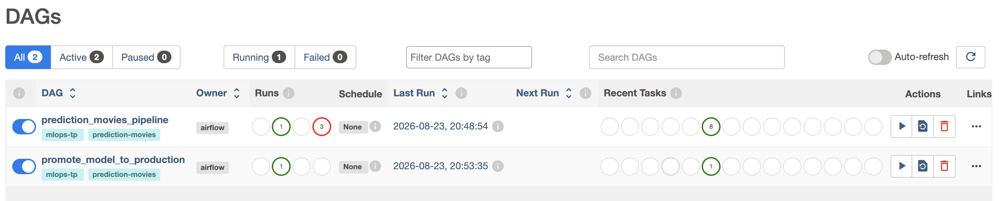
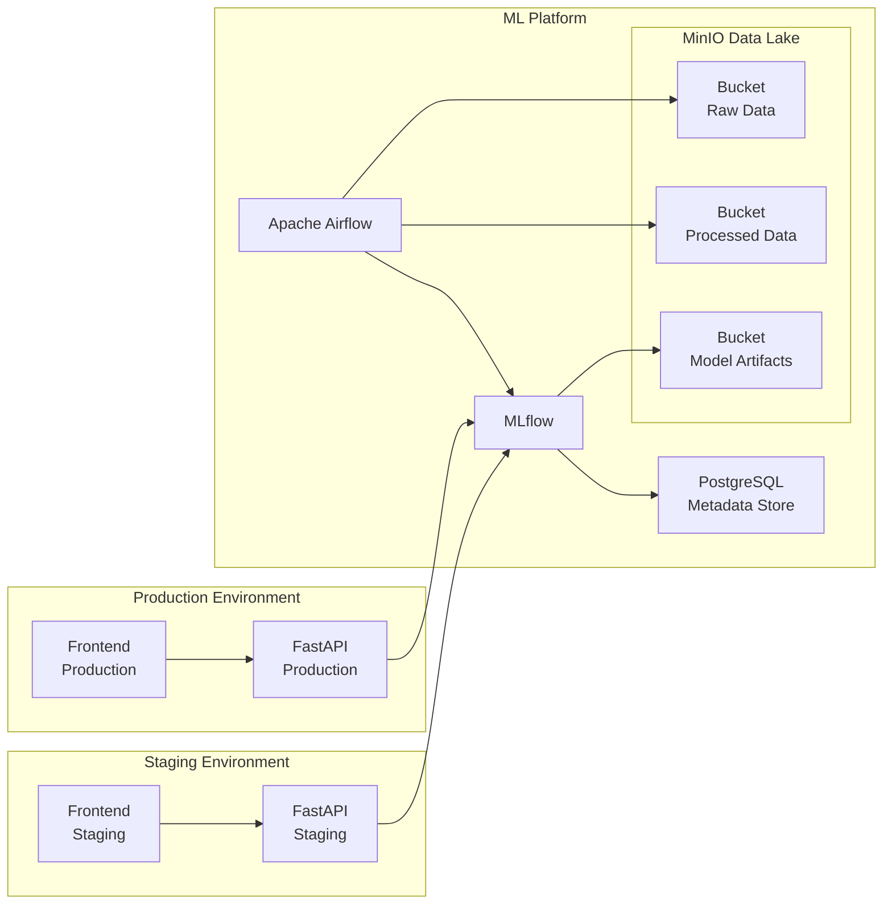
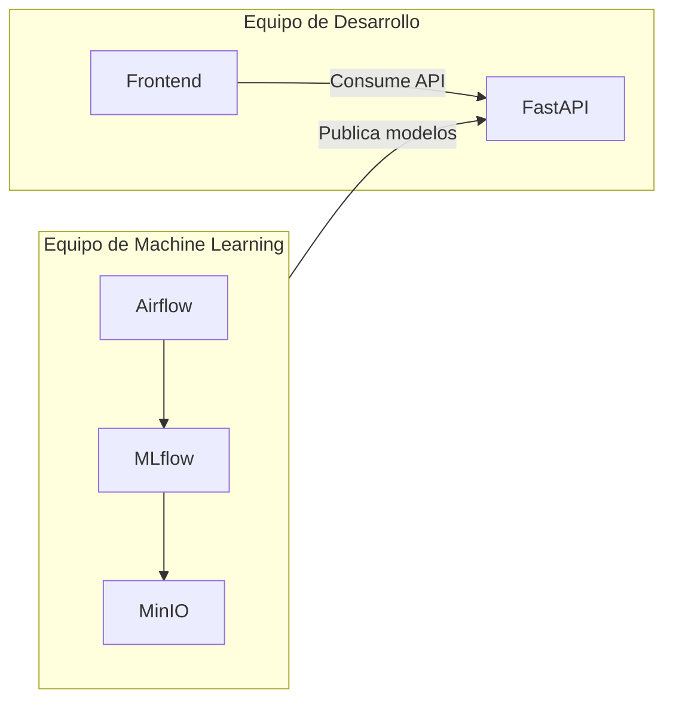

# ML Models and Something More Inc. - MLOps Platform

Este proyecto implementa una plataforma de **MLOps** utilizando una arquitectura completamente desplegada mediante Docker Compose.

El objetivo es simular una plataforma productiva donde un equipo de Ciencia de Datos puede entrenar, versionar y publicar modelos de Machine Learning, mientras que distintas aplicaciones consumidoras pueden realizar inferencias mediante una API REST sin conocer los detalles internos del ciclo de vida del modelo.

La solución utiliza herramientas ampliamente utilizadas en la industria:

* Apache Airflow para la orquestación de pipelines de DataOps y MLOps.
* MLflow para el seguimiento de experimentos y el registro de modelos.
* MinIO para simulación de un servicio de almacenamiento S3 de AWS.
* PostgreSQL como base de datos para metadatos de MLflow.
* FastAPI para exponer los modelos mediante una REST API.
* React para el Frontend de la app cliente.
* Docker Compose para orquestar toda la plataforma.

---

# Integrantes:

- Matías Guillermo Alfaro
- Gonzalo Cuervo
- Nicolas Alberto Tonnelier
- Marina Andrea Racciatti

---

# Objetivos

La plataforma permite:

* almacenar datasets en un Data Lake;
* ejecutar pipelines automáticos de entrenamiento;
* registrar experimentos de Machine Learning;
* versionar modelos;
* promover modelos entre ambientes;
* exponer modelos mediante una REST API;
* validar una nueva versión del modelo antes de utilizarla en producción;
* mantener completamente aislados los consumidores de Staging y Production.

---

# Recorrido por Demo de MLOps Platform

La demo implementa una plataforma MLOps completa para el entrenamiento,
registro, versionado, validación y despliegue de modelos de predicción de
rentabilidad de películas.


# Requisitos

Todo corre dentro de contenedores: no hace falta instalar Python, Node, Airflow, MLflow ni ninguna librería del proyecto en la máquina host. Lo único necesario es:

* **Docker Engine** con el plugin **Compose V2** (comando `docker compose`, no el binario standalone `docker-compose` v1 — el `docker-compose.yml` usa `depends_on: condition: service_completed_successfully`, que la v1 no soporta).
* **[Git LFS](https://git-lfs.com/)** instalado (`git lfs install`, una única vez por máquina) — `TMDB_movie_dataset_v11.csv` está versionado en el repo con LFS (ver "Dataset" más abajo); sin esto, al clonar sólo se obtiene un puntero de texto en vez del CSV real.
* **~5 GB de espacio libre en disco**: imágenes de los servicios + el dataset (`TMDB_movie_dataset_v11.csv`, ~600 MB) + los datos procesados que Airflow genera durante el entrenamiento.
* Los puertos por defecto libres en el host: `9000`/`9001` (MinIO), `5050` (MLflow), `8080` (Airflow), `8001`/`8002` (FastAPI Staging/Production), `3001`/`3002` (Frontend Staging/Production). Todos son configurables desde `.env` si alguno está ocupado (ver el aviso sobre macOS y el puerto 5000 más abajo).

Nota: la carga del dataset demanda uso intensivo de memoria, y dependiendo de su configuración local, este paso puede exceder los recursos disponibles para Docker generando un Out of Memory error. Si encuentra este problema trabaje con un dataset más chico. Por ejemplo, puede recortar la cantidad de files del presente dataset con el comando `head -n 1000 dataset/TMDB_movie_dataset_v11.csv > dataset/TMDB_movie_dataset_v11.csv`.

### 1. Levantar la plataforma

```bash
cp .env.template .env
```

Completar en el `.env` recién creado `AIRFLOW_FERNET_KEY` y `AIRFLOW_SECRET_KEY`, generándolos con los comandos que indica el propio `.env.template`.

El resto de las variables (MinIO, Postgres, usuario admin de Airflow, puertos) ya vienen con valores demo utilizables tal cual para desarrollo local.

Para levantar todos los servicios ejecutar desde la raíz del proyecto:

sudo docker compose up -d

El primer inicio puede demorar aproximadamente **10 a 15 minutos**, ya que
Docker debe construir las imágenes, crear e inicializar los servicios,
configurar las dependencias entre ellos y ejecutar el pipeline inicial de
entrenamiento. Si los servicios de fastapi fallan por healthy, por favor subir 
los reintentos de ese servicio en docker compose.

### 2. — Verificar Airflow

http://localhost:8080/home

Ingresar a Airflow y revisar el DAG de entrenamiento inicial.

Verificar que las tareas hayan finalizado correctamente.



### 3. Revisar MLflow

http://localhost:5050

Ingresar a MLflow y abrir el modelo:

PredictionMovies

Verificar las versiones, métricas y aliases registrados.

### 4. Revisar MinIO

http://localhost:9001/

Ingresar a la consola de MinIO y comprobar los buckets y artefactos generados.

### 5. Probar Staging

http://localhost:3001

Ingresar al frontend de Staging y realizar algunas predicciones.

El frontend utilizará el modelo asociado al alias: staging



### 6. Probar Production

http://localhost:3002

Ingresar al frontend de Production y realizar algunas predicciones.

El frontend utilizará el modelo asociado al alias: production

### 7. Promover el modelo

Desde Airflow ejecutar manualmente el DAG:

promote-model



Este DAG obtiene el modelo de Staging, lo promociona a Production y solicita
a FastAPI Production que recargue el modelo. 

### 8. Revisar nueva modelo en Production

Finalmente, ingresar al frontend de Production y realizar una predicción.

La aplicación utilizará la nueva versión del modelo sin necesidad de
reconstruir ni reiniciar el contenedor de FastAPI.

# Arquitectura

La solución se divide en tres dominios independientes.



## 1. Plataforma de MLOps

Es el núcleo de la solución. Es el lugar de trabajo de los ML engineers y Data Scientist.

Está formada por los siguientes servicios:

* Apache Airflow
* MLflow
* PostgreSQL
* MinIO

Todos estos componentes se encuentran conectados a una red Docker denominada:

```
ml-platform-network
```

Esta red no es accesible directamente por las aplicaciones cliente.

Su responsabilidad es:

* almacenar datos;
* entrenar modelos;
* registrar experimentos;
* administrar el ciclo de vida de los modelos.

---

## 2. Ambiente Staging

El ambiente Staging representa una aplicación que valida una nueva versión del modelo antes de publicarla en producción.

Está compuesto por:

* Frontend Staging
* FastAPI Staging

Ambos servicios pertenecen únicamente a la red:

```
staging-network
```

El servicio FastAPI Staging también posee acceso a:

```
ml-platform-network
```

para poder descargar el modelo registrado en MLflow correspondiente al ambiente Staging.

El Frontend únicamente puede comunicarse con FastAPI.

No posee acceso directo a la plataforma de ML.

---

## 3. Ambiente Production

Representa la aplicación utilizada por los usuarios finales.

Está compuesto por:

* Frontend Production
* FastAPI Production

Ambos servicios pertenecen a:

```
production-network
```

Al igual que ocurre con Staging, únicamente el servicio FastAPI tiene acceso adicional a la red de la plataforma de ML.

El Frontend nunca accede directamente a MLflow ni a MinIO.


---

# Roles y responsabilidades

La arquitectura propuesta separa claramente las responsabilidades entre el equipo encargado de desarrollar las aplicaciones consumidoras y el equipo responsable de la plataforma de Machine Learning.

Esta separación permite que la evolución de los modelos y la evolución de las aplicaciones sean procesos independientes, reduciendo el acoplamiento entre ambos equipos.

---

## Equipo de Desarrollo de Aplicaciones

Es el responsable de las aplicaciones que consumen los modelos de Machine Learning.

Administra los siguientes componentes:

* Frontend Staging
* FastAPI Staging
* Frontend Production
* FastAPI Production

Sus responsabilidades incluyen:

* desarrollar nuevas funcionalidades para las aplicaciones;
* implementar la lógica de negocio;
* definir y mantener los contratos de la API REST utilizada por los clientes;
* integrar las aplicaciones con los modelos publicados por la plataforma de ML;
* desplegar nuevas versiones de las aplicaciones en cada ambiente;
* validar la integración con nuevas versiones de modelos antes de su publicación en producción.

Este equipo **no participa del entrenamiento de modelos** ni administra el ciclo de vida de Machine Learning.

---

## Equipo de Machine Learning

Es el responsable de toda la plataforma de MLOps.

Administra los siguientes componentes:

* Apache Airflow
* MLflow
* PostgreSQL
* MinIO

Sus responsabilidades incluyen:

* construir y mantener los pipelines de DataOps y MLOps;
* desarrollar el código de entrenamiento de los modelos;
* implementar el preprocesamiento y el feature engineering;
* monitorear los experimentos de entrenamiento;
* registrar y versionar modelos mediante MLflow;
* promover modelos entre los estados Staging y Production;
* administrar los datasets y artefactos almacenados en MinIO.

Este equipo no desarrolla las aplicaciones consumidoras ni modifica su lógica de negocio.

---

## Flujo de colaboración

La interacción entre ambos equipos se produce únicamente mediante el Model Registry de MLflow.

El flujo de trabajo es el siguiente:

1. El equipo de Machine Learning entrena una nueva versión del modelo utilizando los datos almacenados en MinIO.
2. El modelo es registrado en MLflow junto con sus métricas y artefactos.
3. Una vez validado, el modelo es promovido al estado **Staging**.
4. El equipo de Desarrollo reinicia el servicio FastAPI del ambiente Staging para cargar la nueva versión del modelo y realiza las pruebas funcionales desde la aplicación cliente.
5. Si la validación es satisfactoria, el equipo de Machine Learning promueve el modelo al estado **Production**.
6. Finalmente, el servicio FastAPI de Production carga la nueva versión del modelo y queda disponible para los usuarios finales.

Esta separación permite que ambos equipos trabajen de forma independiente, compartiendo únicamente una interfaz bien definida: el modelo registrado en MLflow.

## Interacción entre equipos



# Componentes

## MinIO

MinIO simula un servicio Amazon S3.

Actualmente se usan dos buckets (`DATALAKE_BUCKET_NAME` y `MODEL_ARTIFACTS_BUCKET_NAME` en `.env`):

### Data Lake (`datalake`)

Contiene el dataset original (`raw/TMDB_movie_dataset_v11.csv`), subido por la tarea `load_data` del DAG. Estos datos nunca son modificados.

Nota: la separación en un bucket "Raw Data" y otro "Processed Data" que muestra el diagrama de arquitectura más arriba es el diseño objetivo; hoy ambos están unificados en este único bucket `datalake` (ver sección TODO).

---

### Model Artifacts (`model-artifacts`)

Es utilizado por MLflow como Artifact Store.

Aquí se almacenan:

* modelos entrenados;
* matrices de confusión;
* métricas;

---

## PostgreSQL

PostgreSQL actúa como Backend Store de MLflow.

Aquí se almacenan:

* experimentos;
* parámetros;
* métricas;
* versiones;
* información del Model Registry.

Los archivos binarios de los modelos nunca se almacenan aquí.

---

## MLflow

MLflow administra todo el ciclo de vida del modelo.

Durante el entrenamiento registra:

* parámetros
* métricas
* artefactos

Una vez finalizado el entrenamiento, el modelo se registra dentro del Model Registry.

Ejemplo:

```
PredictionMovies

        Version 1

        Version 2

        Version 3
```

Cada versión puede tener asignado alguno de los siguientes **alias** (`MlflowClient.set_registered_model_alias`, no el mecanismo de *stages* que MLflow fue deprecando):

* `staging`
* `production`

Un alias apunta siempre a una única versión, pero puede reasignarse a otra en cualquier momento (por eso "promover" un modelo es simplemente reasignar el alias `production` a la versión que antes tenía `staging`). Los servicios FastAPI consultan siempre el modelo mediante el alias correspondiente a su ambiente (`models:/PredictionMovies@staging` / `models:/PredictionMovies@production`).

---

## Apache Airflow

Airflow es el encargado de ejecutar los pipelines de DataOps y MLOps.

El DAG principal ejecuta las siguientes tareas:

```
Carga de datos

↓

Validación

↓

Limpieza

↓

Feature Engineering

↓

Entrenamiento

↓

Evaluación

↓

Registro en MLflow
```

Cada tarea es independiente y puede ejecutarse automáticamente mediante un scheduler.

---

# Flujo de entrenamiento

El flujo completo de entrenamiento es el siguiente.

## Paso 1

Los datos son cargados al bucket Raw Data.

---

## Paso 2

Airflow inicia un DAG de entrenamiento.

---

## Paso 3

Se validan los datos.

---

## Paso 4

Se ejecuta el preprocesamiento.

---

## Paso 5

Se genera el dataset procesado.

---

## Paso 6

Se entrena el modelo.

---

## Paso 7

Se calculan las métricas.

---

## Paso 8

MLflow registra:

* parámetros
* métricas
* artefactos
* versión del modelo

---

## Paso 9

El modelo queda disponible para ser promovido al ambiente Staging o Production.

---

# Flujo de inferencia

## Ambiente Staging

El usuario accede al Frontend Staging.

```
QA Team

↓

Frontend Staging

↓

FastAPI Staging

↓

MLflow

↓

Modelo Staging

↓

Predicción
```

El endpoint FastAPI carga durante su inicialización el modelo registrado en MLflow con estado **Staging**.

Este modelo permanece cargado en memoria hasta que el servicio es reiniciado o se ejecuta un DAG en Airflow para entrenar un nuevo modelo.

---

## Ambiente Production

El flujo es equivalente.

```
Usuarios

↓

Frontend Production

↓

FastAPI Production

↓

MLflow

↓

Modelo Production

↓

Predicción
```

FastAPI Production carga únicamente el modelo registrado como **Production**.

De esta forma es posible validar simultáneamente dos versiones diferentes del mismo modelo.

Por ejemplo:

```
Staging

PredictionMovies v4-RC


Production

PredictionMovies v3
```

---

# Promoción de modelos

Una vez validado un modelo en Staging, éste puede promoverse manualmente ejecutando un DAG en Airflow. Airflow se encarga de enviar un POST a fastapi, para avisarle que recarge el modelo.

```
Version 4

↓

Staging v4-RC

↓

Validación funcional

↓

Production v4
```

No hay un estado "Archived" separado: un alias apunta siempre a una única versión, así que promover una nueva versión simplemente reasigna el alias correspondiente — no hace falta archivar la anterior explícitamente.

---

# Beneficios de la arquitectura

Esta arquitectura proporciona:

* separación entre DataOps y aplicaciones consumidoras;
* versionado completo de modelos;
* reproducibilidad de entrenamientos;
* almacenamiento centralizado de artefactos;
* ambientes aislados para Staging y Production;
* posibilidad de validar nuevas versiones antes de publicarlas;
* arquitectura fácilmente migrable hacia servicios administrados en la nube como Amazon S3, Amazon MWAA, SageMaker Model Registry y SageMaker Endpoints.

---

# Tecnologías utilizadas

| Componente          | Tecnología        |
| ------------------- | ----------------- |
| Orquestación        | Apache Airflow    |
| Experiment Tracking | MLflow            |
| Model Registry      | MLflow            |
| Metadata Store      | PostgreSQL        |
| Data Lake           | MinIO             |
| API REST            | FastAPI           |
| Frontend Demo       | React (o similar) |
| Contenedores        | Docker            |
| Orquestación local  | Docker Compose    |

---

# Estructura del proyecto

```
trabajo-final-mlops1/
│
├── mlops-platform/                             # codigo de infraestructura
│   ├── airflow/                                # Dockerfile + requirements.txt de Airflow
│   │   └── Dockerfile
│   ├── mlflow/                                 # Dockerfile + requirements.txt del server de MLflow
│   │   └── Dockerfile
│   └── postgresql/
│       └── Dockerfile
│
├── prediction_movies_ml/                       # codigo de modelos y datos
│   ├── dags/
│   │   ├── promote_model.py                    # ejecucion manual desde airflow
│   │   └── prediction_movies_pipeline.py       # ejecucion automatica
│   ├── dataset/
│   │   └── # dataset                           # TMDB_movie_dataset_v11.csv, versionado con Git LFS
│   └── ml/
│       └── #codigo python de modelos por version
│
├── client-app/
│   └── app/
│       ├── fastapi/                            # codigo de backend app y dockerfile
│       └── react/                              # codigo de frontend app y dockerfile
│
├── env.template
├── docker-compose.yml
├── License
└── README.md
```

`fastapi-staging`/`fastapi-production` y `frontend-staging`/`frontend-production` **no** son directorios separados: son la misma imagen de `client-app/fastapi`/`client-app/react`, instanciada dos veces en `docker-compose.yml` y diferenciada por variables de entorno (`MODEL_ALIAS`) y build args (`VITE_API_URL`).

---

# Configuración

## Variables de entorno

La plataforma se configura mediante un archivo `.env` en la raíz del repositorio, leído por Docker Compose. Para crear el propio:

```bash
cp .env.template .env
```

`.env.template` (versionado en git) documenta todas las variables necesarias con valores de ejemplo. Son todas credenciales demo para desarrollo local (MinIO, Postgres, Airflow) y pueden dejarse como están.

## Dataset

`TMDB_movie_dataset_v11.csv` está versionado directamente en el repositorio, en `mlops-platform/dataset/`, usando [Git LFS](https://git-lfs.com/) (pesa ~600MB, demasiado para versionarlo como blob normal de git). Por eso hace falta tener `git-lfs` instalado (`git lfs install`, una única vez por máquina) **antes** de clonar o hacer `git pull` — si el archivo aparece como un texto corto tipo `version https://git-lfs.github.com/spec/v1 ...` en vez del CSV real, es que faltó ese paso: correr `git lfs pull` para traer el contenido real.

La tarea `load_data` del DAG (`mlops-platform/dags/prediction_movies_pipeline.py`) sube ese archivo al bucket Raw Data de MinIO la primera vez que se corre el DAG (si el archivo ya está en MinIO, no lo vuelve a subir). Esto no pasa solo: hay que disparar el DAG manualmente (UI via http://localhost:8080 o `airflow dags trigger prediction_movies_pipeline`) y, si es la primera vez que corre, despausarlo antes (manualmente en la UI o `airflow dags unpause prediction_movies_pipeline`), porque todo DAG nuevo arranca pausado en Airflow.

---

# Future Work

• Model Monitoring

• Data Drift Detection

• Concept Drift

• Automated Retraining

• Advanced Deployment Strategies

• Input data control from the frontend

---

