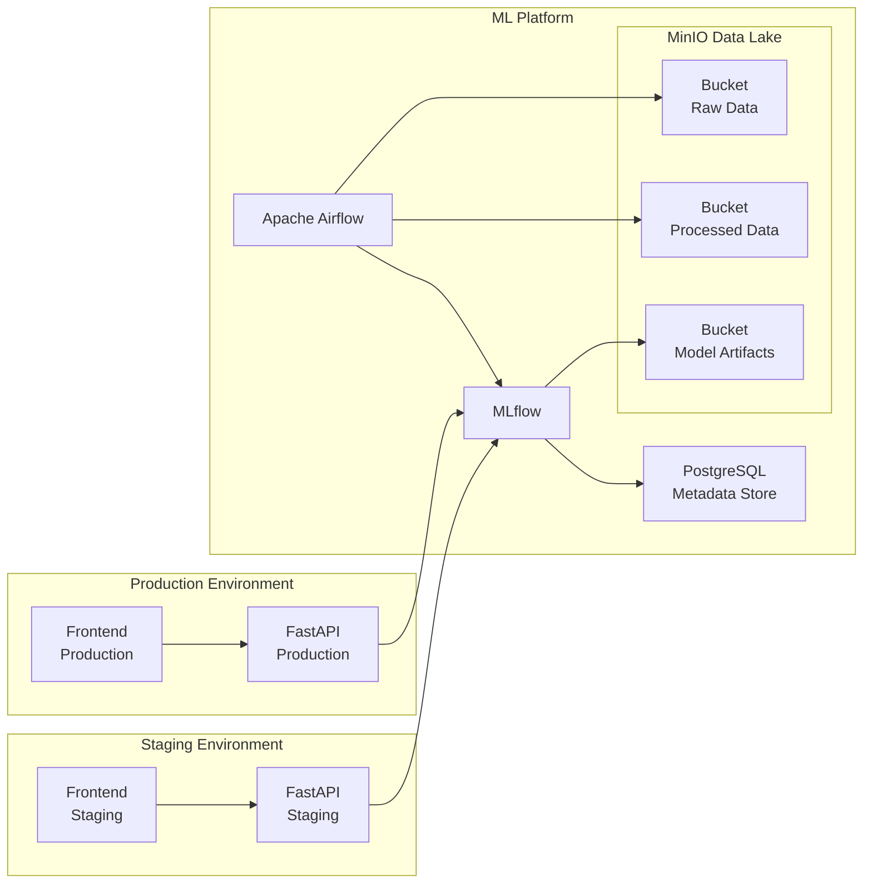
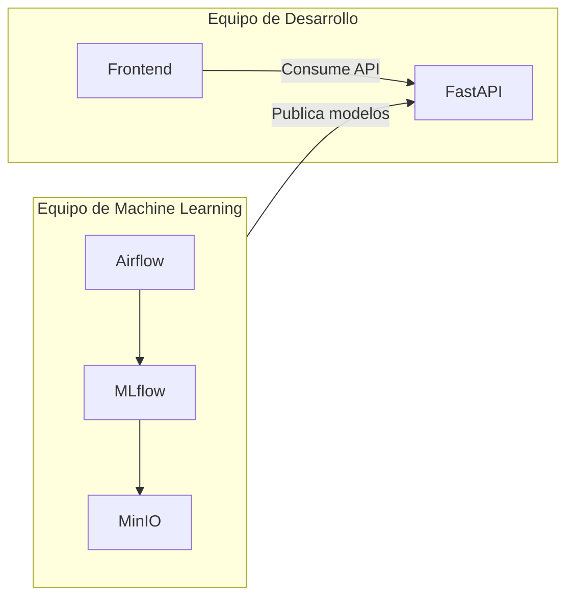
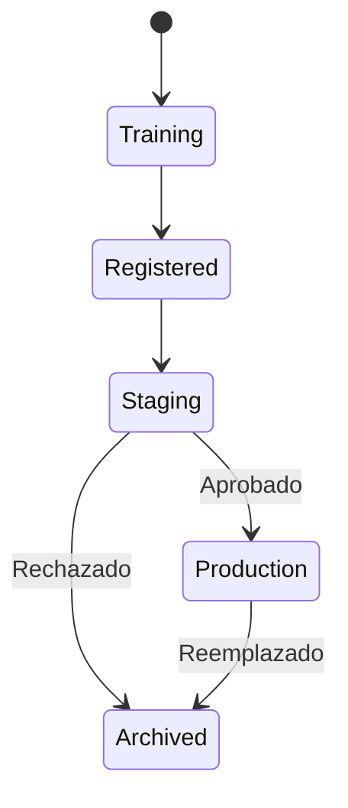

# ML Models and Something More Inc. - MLOps Platform

Este proyecto implementa una plataforma de **MLOps** utilizando una arquitectura completamente desplegada mediante Docker Compose.

El objetivo es simular una plataforma productiva donde un equipo de Ciencia de Datos puede entrenar, versionar y publicar modelos de Machine Learning, mientras que distintas aplicaciones consumidoras pueden realizar inferencias mediante una API REST sin conocer los detalles internos del ciclo de vida del modelo.

La solución utiliza herramientas ampliamente utilizadas en la industria:

* Apache Airflow para la orquestación de pipelines de DataOps y MLOps.
* MLflow para el seguimiento de experimentos y el registro de modelos.
* MinIO para simulación de un servicio de almacenamiento S3 de AWS.
* PostgreSQL como base de datos para metadatos de MLflow.
* FastAPI para exponer los modelos mediante una REST API.
* React para el Frontend de la app cliente.
* Docker Compose para orquestar toda la plataforma.

---

# Objetivos

La plataforma permite:

* almacenar datasets en un Data Lake;
* ejecutar pipelines automáticos de entrenamiento;
* registrar experimentos de Machine Learning;
* versionar modelos;
* promover modelos entre ambientes;
* exponer modelos mediante una REST API;
* validar una nueva versión del modelo antes de utilizarla en producción;
* mantener completamente aislados los consumidores de Staging y Production.

---

# Arquitectura

La solución se divide en tres dominios independientes.



## 1. Plataforma de MLOps

Es el núcleo de la solución. Es el lugar de trabajo de los ML engineers y Data Scientist.

Está formada por los siguientes servicios:

* Apache Airflow
* MLflow
* PostgreSQL
* MinIO

Todos estos componentes se encuentran conectados a una red Docker denominada:

```
ml-platform-network
```

Esta red no es accesible directamente por las aplicaciones cliente.

Su responsabilidad es:

* almacenar datos;
* entrenar modelos;
* registrar experimentos;
* administrar el ciclo de vida de los modelos.

---

## 2. Ambiente Staging

El ambiente Staging representa una aplicación que valida una nueva versión del modelo antes de publicarla en producción.

Está compuesto por:

* Frontend Staging
* FastAPI Staging

Ambos servicios pertenecen únicamente a la red:

```
staging-network
```

El servicio FastAPI Staging también posee acceso a:

```
ml-platform-network
```

para poder descargar el modelo registrado en MLflow correspondiente al ambiente Staging.

El Frontend únicamente puede comunicarse con FastAPI.

No posee acceso directo a la plataforma de ML.

---

## 3. Ambiente Production

Representa la aplicación utilizada por los usuarios finales.

Está compuesto por:

* Frontend Production
* FastAPI Production

Ambos servicios pertenecen a:

```
production-network
```

Al igual que ocurre con Staging, únicamente el servicio FastAPI tiene acceso adicional a la red de la plataforma de ML.

El Frontend nunca accede directamente a MLflow ni a MinIO.


---

# Roles y responsabilidades

La arquitectura propuesta separa claramente las responsabilidades entre el equipo encargado de desarrollar las aplicaciones consumidoras y el equipo responsable de la plataforma de Machine Learning.

Esta separación permite que la evolución de los modelos y la evolución de las aplicaciones sean procesos independientes, reduciendo el acoplamiento entre ambos equipos.

---

## Equipo de Desarrollo de Aplicaciones

Es el responsable de las aplicaciones que consumen los modelos de Machine Learning.

Administra los siguientes componentes:

* Frontend Staging
* FastAPI Staging
* Frontend Production
* FastAPI Production

Sus responsabilidades incluyen:

* desarrollar nuevas funcionalidades para las aplicaciones;
* implementar la lógica de negocio;
* definir y mantener los contratos de la API REST utilizada por los clientes;
* integrar las aplicaciones con los modelos publicados por la plataforma de ML;
* desplegar nuevas versiones de las aplicaciones en cada ambiente;
* validar la integración con nuevas versiones de modelos antes de su publicación en producción.

Este equipo **no participa del entrenamiento de modelos** ni administra el ciclo de vida de Machine Learning.

---

## Equipo de Machine Learning

Es el responsable de toda la plataforma de MLOps.

Administra los siguientes componentes:

* Apache Airflow
* MLflow
* PostgreSQL
* MinIO

Sus responsabilidades incluyen:

* construir y mantener los pipelines de DataOps y MLOps;
* desarrollar el código de entrenamiento de los modelos;
* implementar el preprocesamiento y el feature engineering;
* monitorear los experimentos de entrenamiento;
* registrar y versionar modelos mediante MLflow;
* promover modelos entre los estados Staging y Production;
* administrar los datasets y artefactos almacenados en MinIO.

Este equipo no desarrolla las aplicaciones consumidoras ni modifica su lógica de negocio.

---

## Flujo de colaboración

La interacción entre ambos equipos se produce únicamente mediante el Model Registry de MLflow.

El flujo de trabajo es el siguiente:

1. El equipo de Machine Learning entrena una nueva versión del modelo utilizando los datos almacenados en MinIO.
2. El modelo es registrado en MLflow junto con sus métricas y artefactos.
3. Una vez validado, el modelo es promovido al estado **Staging**.
4. El equipo de Desarrollo reinicia el servicio FastAPI del ambiente Staging para cargar la nueva versión del modelo y realiza las pruebas funcionales desde la aplicación cliente.
5. Si la validación es satisfactoria, el equipo de Machine Learning promueve el modelo al estado **Production**.
6. Finalmente, el servicio FastAPI de Production carga la nueva versión del modelo y queda disponible para los usuarios finales.

Esta separación permite que ambos equipos trabajen de forma independiente, compartiendo únicamente una interfaz bien definida: el modelo registrado en MLflow.

## Interacción entre equipos



# Componentes

## MinIO

MinIO simula un servicio Amazon S3.

Se utiliza para almacenar tres buckets independientes.

### Raw Data

Contiene el dataset original: TMDB_movie_dataset_v11.csv

Estos datos nunca son modificados.

---

### Processed Data

Contiene los datasets generados durante el proceso de limpieza y feature engineering.

Estos datos permiten reproducir exactamente un entrenamiento realizado anteriormente.

---

### Model Artifacts

Es utilizado por MLflow como Artifact Store.

Aquí se almacenan:

* modelos entrenados;
* pipelines de preprocesamiento;
* matrices de confusión;
* métricas;
* cualquier artefacto generado durante el entrenamiento.

---

## PostgreSQL

PostgreSQL actúa como Backend Store de MLflow.

Aquí se almacenan:

* experimentos;
* parámetros;
* métricas;
* versiones;
* información del Model Registry.

Los archivos binarios de los modelos nunca se almacenan aquí.

---

## MLflow

MLflow administra todo el ciclo de vida del modelo.

Durante el entrenamiento registra:

* parámetros
* métricas
* artefactos

Una vez finalizado el entrenamiento, el modelo se registra dentro del Model Registry.

Ejemplo:

```
PredictionMovies

        Version 1

        Version 2

        Version 3
```

Cada versión puede encontrarse en alguno de los siguientes estados:

* Staging
* Production
* Archived

Los servicios FastAPI consultan siempre el modelo correspondiente al estado de su ambiente.

---

## Apache Airflow

Airflow es el encargado de ejecutar los pipelines de DataOps y MLOps.

El DAG principal ejecuta las siguientes tareas:

```
Carga de datos

↓

Validación

↓

Limpieza

↓

Feature Engineering

↓

Entrenamiento

↓

Evaluación

↓

Registro en MLflow
```

Cada tarea es independiente y puede ejecutarse automáticamente mediante un scheduler.

---

# Flujo de entrenamiento

El flujo completo de entrenamiento es el siguiente.

## Paso 1

Los datos son cargados al bucket Raw Data.

---

## Paso 2

Airflow inicia un DAG de entrenamiento.

---

## Paso 3

Se validan los datos.

---

## Paso 4

Se ejecuta el preprocesamiento.

---

## Paso 5

Se genera el dataset procesado.

---

## Paso 6

Se entrena el modelo.

---

## Paso 7

Se calculan las métricas.

---

## Paso 8

MLflow registra:

* parámetros
* métricas
* artefactos
* versión del modelo

---

## Paso 9

El modelo queda disponible para ser promovido al ambiente Staging o Production.

---

# Flujo de inferencia

## Ambiente Staging

El usuario accede al Frontend Staging.

```
QA Team

↓

Frontend Staging

↓

FastAPI Staging

↓

MLflow

↓

Modelo Staging

↓

Predicción
```

El endpoint FastAPI carga durante su inicialización el modelo registrado en MLflow con estado **Staging**.

Este modelo permanece cargado en memoria hasta que el servicio es reiniciado.

---

## Ambiente Production

El flujo es equivalente.

```
Usuarios

↓

Frontend Production

↓

FastAPI Production

↓

MLflow

↓

Modelo Production

↓

Predicción
```

FastAPI Production carga únicamente el modelo registrado como **Production**.

De esta forma es posible validar simultáneamente dos versiones diferentes del mismo modelo.

Por ejemplo:

```
Staging

PredictionMovies v4-RC


Production

PredictionMovies v3
```

---

# Promoción de modelos

Una vez validado un modelo en Staging, éste puede promoverse dentro de MLflow.

```
Version 4

↓

Staging

↓

Validación funcional

↓

Production
```

Posteriormente se reinicia el servicio FastAPI correspondiente para que cargue automáticamente la nueva versión del modelo.



---

# Beneficios de la arquitectura

Esta arquitectura proporciona:

* separación entre DataOps y aplicaciones consumidoras;
* versionado completo de modelos;
* reproducibilidad de entrenamientos;
* almacenamiento centralizado de artefactos;
* ambientes aislados para Staging y Production;
* posibilidad de validar nuevas versiones antes de publicarlas;
* arquitectura fácilmente migrable hacia servicios administrados en la nube como Amazon S3, Amazon MWAA, SageMaker Model Registry y SageMaker Endpoints.

---

# Tecnologías utilizadas

| Componente          | Tecnología        |
| ------------------- | ----------------- |
| Orquestación        | Apache Airflow    |
| Experiment Tracking | MLflow            |
| Model Registry      | MLflow            |
| Metadata Store      | PostgreSQL        |
| Data Lake           | MinIO             |
| API REST            | FastAPI           |
| Frontend Demo       | React (o similar) |
| Contenedores        | Docker            |
| Orquestación local  | Docker Compose    |

---

# Estructura del proyecto

```
.
├── airflow/
├── dags/
├── ml/
│   ├── training/
│   ├── preprocessing/
│   └── inference/
├── mlflow/
├── fastapi-staging/
├── fastapi-production/
├── frontend-staging/
├── frontend-production/
├── postgres/
├── minio/
├── docker-compose.yml
└── README.md
```

# Future Work

• Model Monitoring

• Data Drift Detection

• Concept Drift

• Automated Retraining

• Canary Deployments